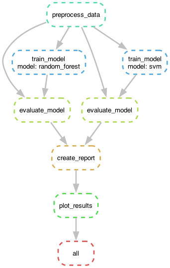

This repository contains the code and resources for an example project utilizing Snakemake, a powerful workflow management system. The primary goal of this project is to harness machine learning models for the preprocessing and analysis of the Iris dataset, a classic dataset widely used for demonstrating machine learning techniques.

### Key Components of the Project:

1. **Data Preprocessing**:
   - The project includes scripts to clean and preprocess the Iris dataset. This step ensures that the data is in the required format for machine learning algorithms.

2. **Model Training**:
   - Various machine learning models are trained on the preprocessed data. 

3. **Model Evaluation**:
   - After training, the models' performance is evaluated. 

4. **Visualization**:
   - The project also includes scripts to visualize the results of the analysis. 
   
### Parallelization:

Both the training and evaluation of models are parallelized, significantly speeding up the workflow. This is particularly beneficial when dealing with large datasets or complex models, where computation can be time-consuming.





## Installation

To run this project, you need to have Snakemake installed. You can install snakemake using the following command:

```sh
pip install snakemake 
```

## Usage

You can run rules seperately to test rules

1. **Preprocess the Data**: Run the Snakemake workflow to preprocess the Iris dataset.
    ```sh
    snakemake -s main.smk preprocess_data
    ```

2. **Train Models**: Train the specified machine learning models.
    ```sh
    snakemake -s main.smk train_model
    ```

3. **Evaluate Models**: Evaluate the performance of the trained models.
    ```sh
    snakemake -s main.smk evaluate_model
    ```

4. **Create Report**: Generate a final report combining the evaluation results.
    ```sh
    snakemake -s main.smk create_report
    ```

5. **Plot Results**: Create a bar chart comparing the model accuracies.
    ```sh
    snakemake -s main.smk plot_results
    ```

6. **Generate DAG**: Visualize the workflow DAG.
    ```sh
    snakemake -s main.smk --dag | dot -Tpdf > dag.pdf
    ```
    
 7. To run all at once at available cores
    ```sh
    snakemake -s main.smk --cores 4
    ```
 
 ## Project Structure

After running the pipeline the resulting project structure looks like this

```plaintext
.
├── data
│   └── test_.csv
│   └── train_data.csv
├── output
│   ├── accuracy_plot.png
│   ├── final_report.csv
│   ├── benchmarks
│   │   ├── train_random_forest.txt
│   │   ├── train_svm.txt
│   └── models
│       ├── random_forest_model.pkl
│       └── svm_model.pkl
├── scripts
│   ├── preprocess.py
│   ├── train_random_forest.py
│   ├── train_svm.py
│   ├── evaluate.py
│   └── plot_results.py
├── main.smk
```


## Benchmarking

The project includes benchmarking for each model training. The benchmarking results are saved in the `output/benchmarks` directory.

## License

This project is licensed under the GNU License. See the `LICENSE` file for more details.

## Contact

f.feenstra@pl.hanze.nl

